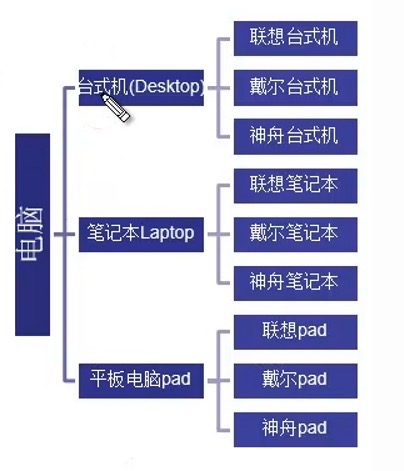
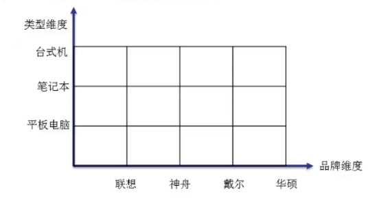
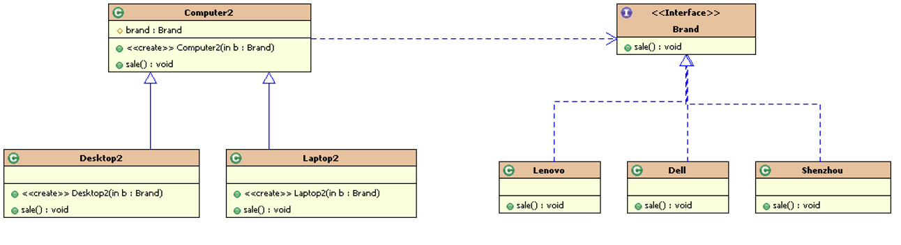
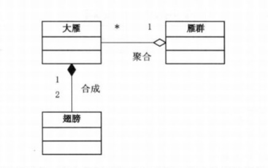

## 桥接模式

### 1.场景

- 商城系统中常见的商品分类，以电脑分类，如何处理好商品分类的销售问题？
- 我们可以用<font color=red size=4>多继承结构</font>实现电脑分类



- 问题：
	- 扩展性问题 （如果要增加新的电脑类型或者新的品牌类型，则需要增加电脑或者品牌类型的类，不管新增一个类型还是新增一个品牌，都会牵扯出另外一个维度的变化。）
	- 违反单一职责原则 （一个类有两个引起这个类变化的原因，一个电脑品牌，一个电脑类型）


### 2.场景分析

这个场景中有两个变化的维度：电脑类型、电脑品牌。




### 3.桥接模式

<font color=red>桥接模式的核心要点是：处理多层继承结构或者处理多维度变化的场景，将各个维度设计成独立的继承结构，各个维度可以独立扩展，然后在抽象层建立关联</font>



代码实现：

```java

/**
 * 电脑品牌分类
 */
public interface Brand {
    void sale();


    /**
     * 戴尔品牌
     */
    public static class Dell implements Brand {
        @Override
        public void sale() {
            System.out.println("出售戴尔电脑");
        }
    }


    /**
     * 联想品牌
     */
    public class Lenovo implements Brand {
        @Override
        public void sale() {
            System.out.println("出售联想电脑");
        }
    }
}
```

```java
/**
 * 电脑类型分类
 */
public class Computer {
    protected Brand mBrand;

    public Computer(Brand brand) {
        mBrand = brand;
    }

    public void sale() {
        mBrand.sale();
    }


    /**
     * 台式电脑
     */
    public static class Desktop extends Computer {

        public Desktop(Brand brand) {
            super(brand);
        }

        @Override
        public void sale() {
            super.sale();
            System.out.println("出售台式电脑");
        }
    }


    /**
     * 笔记本电脑
     */
    public static class Laptop extends Computer {

        public Laptop(Brand brand) {
            super(brand);
        }

        @Override
        public void sale() {
            super.sale();
            System.out.println("出售笔记本");
        }
    }
}
```

```java
public class BridgingTest {

    public static void main(String[] args) {
       //联想台式电脑
        Computer computer = new Computer.Desktop(new Brand.Lenovo());
        computer.sale();

        //戴尔台式电脑
        computer = new Computer.Desktop(new Brand.Dell());
        computer.sale();

        //联想笔记本
        computer = new Computer.Laptop(new Brand.Lenovo());
        computer.sale();

        //戴尔笔记本
        computer = new Computer.Laptop(new Brand.Dell());
        computer.sale();    }
}
```

### 4.总结

桥接模式极大的提高了系统可扩展性，在两个变化维度中任意扩展一个维度，都不需要修改原有的系统，符合开闭原则。

桥接模式也符合了另外一个原则：合成/聚合复用原则

聚合表示一种弱的‘拥有’关系，体现的A对象可以包含B对象，但是B对象不是A对象的一部分
合成则是一种强的‘拥有’关系，体现了严格的部分和整体的关系，部分和整体的生命周期一样。

比如：大雁有两个翅膀，翅膀和大雁是部分和整体的关系，并它们的生命周期是一样的，于是大雁和翅膀就是合成关系。而大雁是群居动物，所以每只大雁都是属于一个雁群，一个雁群可以有多只大雁，所以大雁和雁群是聚合关系，如图所示：

