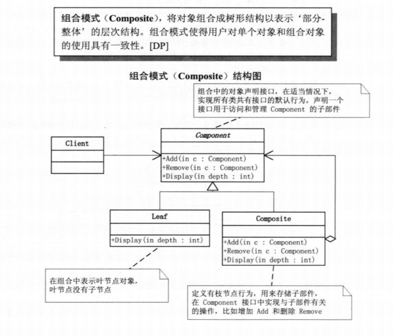

## 组合模式

### 1.定义
组合模式允许你将对象组合成树形结构来表现”部分-整体“的层次结构，使得客户以一致的方式处理单个对象以及对象的组合。
组合模式实现的最关键的地方是：简单对象和复合对象必须实现相同的接口。这就是组合模式能够将组合对象和简单对象进行一致处理的原因。

- 组合部件（Component）：它是一个抽象角色，为要组合的对象提供统一的接口。
- 叶子（Leaf）：在组合中表示子节点对象，叶子节点不能有子节点。
- 合成部件（Composite）：定义有枝节点的行为，用来存储部件，实现在Component接口中的有关操作，如增加（Add）和删除（Remove）。



### 2.代码实现

```java
/**
 * @author xueshanshan
 * @date 2019-09-04
 *
 * 一个抽象构件，声明一个接口用于访问和管理Component的子部件
 */
public abstract class Component {
    protected String name;

    public Component(String name) {
        this.name = name;
    }

    public abstract void add(Component component);

    public abstract void remove(Component component);

    public abstract void display(int level);
}

```

```java
/**
 * @author xueshanshan
 * @date 2019-09-04
 *
 * 叶子节点
 */
public class Leaf extends Component {
    public Leaf(String name) {
        super(name);
    }

    @Override
    public void add(Component component) {
        System.out.println("can not add a component to a leaf");
    }

    @Override
    public void remove(Component component) {
        System.out.println("can not remove a component to a leaf");
    }

    @Override
    public void display(int level) {
        System.out.println(String.format("%0" + level + "d", 0).replace("0", "-") + name);
    }
}
```

```java
/**
 * @author xueshanshan
 * @date 2019-09-04
 *
 * 枝节点
 */
public class Composite extends Component {
    private List<Component> mComponents = new ArrayList<>();

    public Composite(String name) {
        super(name);
    }

    @Override
    public void add(Component component) {
        mComponents.add(component);
    }

    @Override
    public void remove(Component component) {
        mComponents.remove(component);
    }

    @Override
    public void display(int level) {
        System.out.println(String.format("%0" + level + "d", 0).replace("0", "-") + name);
        for (int i = 0; i < mComponents.size(); i++) {
            Component component = mComponents.get(i);
            component.display(level + 2);
        }
    }
}

```

```java
/**
 * @author xueshanshan
 * @date 2019-09-04
 */
public class TestComponent {

    public static void main(String[] args) {
        Composite root = new Composite("Root");
        root.add(new Leaf("Leaf A"));
        root.add(new Leaf("Leaf B"));

        Composite comp = new Composite("Composite X");
        comp.add(new Leaf("Leaf XA"));
        comp.add(new Leaf("Leaf XB"));

        root.add(comp);

        Composite comp2 = new Composite("Composite XY");
        comp2.add(new Leaf("Leaf XYA"));
        comp2.add(new Leaf("Leaf XYB"));

        comp.add(comp2);

        root.add(new Leaf("Leaf C"));
        Leaf leaf_d = new Leaf("Leaf D");
        root.add(leaf_d);
        root.remove(leaf_d);

        root.display(1);
    }
}

输出结果为：
-Root
---Leaf A
---Leaf B
---Composite X
-----Leaf XA
-----Leaf XB
-----Composite XY
-------Leaf XYA
-------Leaf XYB
---Leaf C
```

### 3.透明方式与安全方式

如代码所示，树可能有无数的分支，但是只要反复调用Composite就可以实现树状结构了。
但是问题在于叶子节点并不具备add和remove功能，那为什么还必须强制实现？

上面代码实现方式叫做**透明方式**，也就是说在Component中声明所有用来管理子对象的方法，这样做的好处是叶节点和枝节点对于外界没有什么区别，它们具备完全一致的行为接口，但问题也很明显，因为Leaf本身不具备add() remove()的功能，所以实现它是没有意义的。

当然也可以不那样做，那么就需要**安全模式**，也就是在Component接口中不去声明add和remove方法，那么子节点Leaf就不需要去实现它，而是在Composite声明所有用来管理子类对象的方法，这样做就不会出现刚才的问题，不过由于不透明，所以树枝类和叶子类将不具有相同的接口，客户端调用的时候需要做相应的判断，带来了不便。

具体使用哪种方法，根据实际情况去考虑。


### 4.应用实例

1、现在好多大型公司都有很多子公司，子公司下面又有子公司，而每个子公司又都有自己的各个业务部门，如果想要实现公司管理系统，就需要用该模式来实现。


2、Android中View 和ViewGroup就用了该设计模式