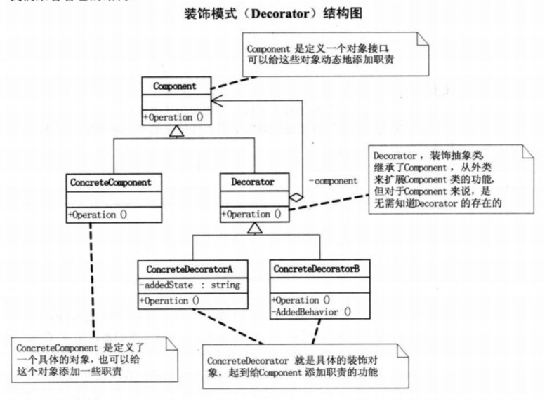

## 装饰器模式

### 概述

现实生活中，常常需要对现有产品增加新的功能或者美化其外观，如房子装修，相片加框等。在软件开发过程中，有时想用一些现存的组件，这些组件可能只是完成了一些核心功能，但在不改变其结构的情况下，可以动态地扩展其功能。所有这些都可以采用装饰器模式来实现。

### 什么是装饰器模式

装饰器模式（Decorator
Pattern）**允许向一个现有的对象添加新的模式，同时又不改变其结构。**这种类型的设计模式属于**结构型模式**，它是作为现有的类的一个包装。这种模式创建了一个装饰类，用来包装原有的类，并在保持类方法签名完整性的前提下，提供了额外的功能。

### 装饰器模式的应用场景

装饰器模式通常在以下几种情况使用：

-   当需要给一个现有类添加附加职责，而又不能采用生成子类的方式进行扩充时。例如：该类被隐藏或者该类是final类或者采用继承方式会产生大量子类。
-   当需要通过对现有的一组基本功能进行排列组合二产生非常多的功能时，采用继承关系很难实现，而采用装饰器模式却很好实现。
-   当对象的功能要求可以动态地添加，也可以再动态的撤销时。

装饰器模式在Java中最著名的应用莫过于Java
I/O标准库的设计了。例如，InputStream的子类FilterInputStream，
OutputStream的子类FilterOutputStream，Reader的子类BufferedReader以及FilterReader，还有Writer的子类Buffer额度Writer、FilterWriter以及PrintWriter等，它们都是抽象装饰类。

Example：FileReader增加缓冲区而采用装饰类BufferedReader的例子：

```java
    BufferedReader in = new BufferedReader(new FileReader("filename.txt"));
    String s = in.readLine();
```

### 装饰器模式优缺点

#### 装饰器模式主要优点有：

-   采用装饰器模式扩展对象的功能比采用继承方式更加灵活。

-   可以设计出多个不同的具体装饰器，创造出多个不同行为的组合。

#### 装饰器模式的主要缺点有：

-   装饰器增加了很多的分类，如果过度使用会使程序变得很复杂。

### 装饰器模式的结构

装饰器模式主要包含以下角色：

1.  抽象构件角色（Component）：定一个抽象接口以规范准备接收附加责任的对象；

2.  具体构件角色（Concrete
    Component）：实现抽象构件，通过装饰角色为其添加一些职责

3.  抽象装饰角色（Decorator）：继承抽象构件，并包含具体构件的实例，可以通过其子类扩展具体构件的功能

4.  具体装饰角色（Concrete
    Decorator）：实现抽象装饰的相关方法，并给具体构件对象添加附加的责任

装饰器模式结构图如下：


 
### 装饰器模式的实现

```java
public abstract class Component {
    public abstract void operation();

    public static class ConcrateComponent extends Component {

        @Override
        public void operation() {
            System.out.println("具体对象的操作");
        }
    }
}

public abstract class Decorator extends Component {
    protected Component mComponent;

    public void setComponent(Component component) {
        mComponent = component;
    }

    @Override
    public void operation() {
        if (mComponent != null) {
            mComponent.operation();
        }
    }


    public static class ConcreateDecoratorA extends Decorator {
        @Override
        public void operation() {
            super.operation();
            System.out.println("具体装饰对象A的操作");
        }
    }

    public static class ConcreateDecoratorB extends Decorator {
        @Override
        public void operation() {
            super.operation();
            System.out.println("具体装饰对象B的操作");
        }
    }
}
```

```java
public class DecoratorTest {
    public static void main(String[] args) {
        Component.ConcrateComponent concrateComponent = new Component.ConcrateComponent();
        Decorator.ConcreateDecoratorA concreateDecoratorA = new Decorator.ConcreateDecoratorA();
        Decorator.ConcreateDecoratorB concreateDecoratorB = new Decorator.ConcreateDecoratorB();

        concreateDecoratorA.setComponent(concrateComponent);
        concreateDecoratorB.setComponent(concreateDecoratorA);
        concreateDecoratorB.operation();
    }
}

//运行结果
具体对象的操作
具体装饰对象A的操作
具体装饰对象B的操作
```

### 装饰器模式的扩展

装饰器模式所包含的4个角色不是任何时候都需要存在的，在有些应用环境下模式是可以简化的，如以下两种情况：

-   如果只有一个具体构件而没有抽象构件时，可以让抽象装饰继承具体构件。（Decorator extends ConcrateComponent  剩余3个角色）

-   如果只有一个具体装饰时，可以将抽象装饰和具体装饰合并。 (ConcreateDecoratorA extends ConcrateComponent  剩余2个角色)

### 装饰器模式和代理模式的区别

代理模式和装饰器模式看起来很像，对装饰器模式来说，装饰者和被装饰者都实现同一个接口；对代理模式来说，代理类和真实处理类都实现同一个接口。此外，不论我们使用哪一个模式，都可以很容易地在真实对象的方法前面或者后面加上自定义的方法。
然而，实际上，在装饰器模式和代理模式之间还是有很多差别的。装饰器模式关注于一个对象上动态的添加方法，然而代理模式关注于控制对对象的访问。换句话说，用代理模式，代理类可以对他的客户隐藏一个对象的具体信息。因此，当使用代理模式的时候，我们通常在一个代理类中创建一个对象的实例。并且，当我们使用装饰器模式时，我们通常的做法是将原始对象作为一个参数传给装饰器的构造器。
一言以蔽之：

**使用代理模式，代理和真实对象之间的关系通常在编译时就已经确定了，而装饰者能够在运行时递归地被构造。**