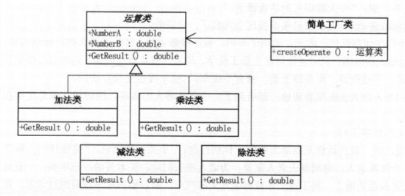
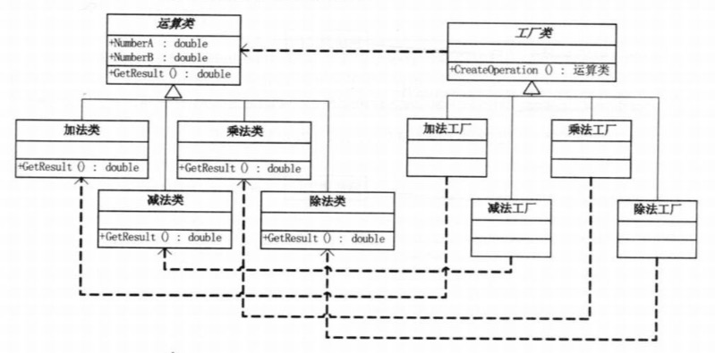
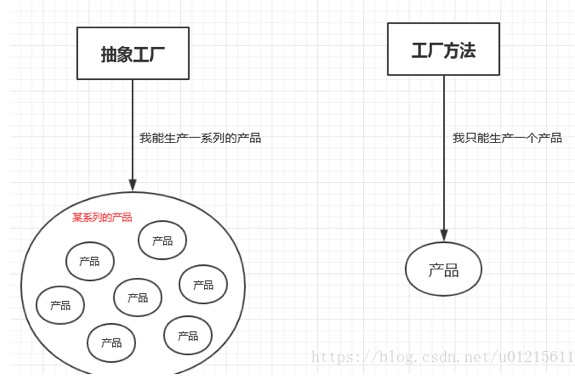

## 简单工厂模式、工厂(方法)模式以及抽象工厂模式

### 一、简单工厂模式

简单工厂模式专门定义一个类来负责创建其他类的实例，被创建的实例通常都具有共同的父类。



具体实现如下：

```java
/**
 * @author xueshanshan
 * @date 2019-09-05
 *
 * 定义一个操作接口
 */
public interface Operation {
    public double getResult(double num1, double num2);

    /**
     * 加法类
     */
    public static class AddOperation implements Operation {

        @Override
        public double getResult(double num1, double num2) {
            return num1 + num2;
        }
    }

    /**
     * 减法类
     */
    public static class SubOperation implements Operation {

        @Override
        public double getResult(double num1, double num2) {
            return num1 - num2;
        }
    }

    /**
     * 乘法类
     */
    public static class MulOperation implements Operation {

        @Override
        public double getResult(double num1, double num2) {
            return num1 * num2;
        }
    }

    /**
     * 乘法类
     */
    public static class DivOperation implements Operation {

        @Override
        public double getResult(double num1, double num2) {
            if (num2 == 0) {
                throw new RuntimeException("除数不能为0");
            }
            return num1 / num2;
        }
    }
}

```

```java
/**
 * @author xueshanshan
 * @date 2019-09-05
 */
public class SimpleFactory {
    //简单工厂，根据字符串创建相应的对象
    public static Operation createOperation(String name) {
        Operation operation = null;
        switch (name) {
            case "+":
                operation = new Operation.AddOperation();
                break;
            case "-":
                operation = new Operation.SubOperation();
                break;
            case "*":
                operation = new Operation.MulOperation();
                break;
            case "/":
                operation = new Operation.DivOperation();
                break;
        }
        return operation;
    }

    public static void main(String[] args) {
        System.out.println(createOperation("+").getResult(1,2));
        System.out.println(createOperation("-").getResult(1,2));
        System.out.println(createOperation("*").getResult(1,2));
        System.out.println(createOperation("/").getResult(1,2));
    }
}

打印结果为：
3.0
-1.0
2.0
0.5
```

优点：工厂隐藏了具体生产细节，甚至可以工厂里面创建对象的时候进行一些“加工”，这些客户端并不知情，客户端不关注对象生产过程中都做了什么操作。

缺点：客户端需要知道生产每个对象对应的参数，而且如果需要生产很多对象，需要增加很多判断条件，每次增加子类或者删除子类对象都需要修改该工厂类，这会导致这个简单工厂类很庞大，耦合性高，而且频繁的修改违反了开闭原则。

### 二、工厂（方法）模式

工厂方法模式是对简单工厂模式进一步的解耦，因为在工厂方法模式中是一个子类对应于一个工厂类，而这些工厂类都实现于一个抽象接口，这相当于把原本因为业务代码庞大的简单工厂类，拆分成了一个个的工厂类，这样代码就不会耦合在一个类里面了。



具体实现如下:

```java
/**
 * @author xueshanshan
 * @date 2019-09-05
 *
 * 工厂方法接口
 */
public interface IFactoryMethod {
    Operation createOperation();

    /**
     * 加法工厂
     */
    public static class AddFactoryMethod implements IFactoryMethod {

        @Override
        public Operation createOperation() {
            return new Operation.AddOperation();
        }
    }

    /**
     * 减法工厂
     */
    public static class SubFactoryMethod implements IFactoryMethod {

        @Override
        public Operation createOperation() {
            return new Operation.SubOperation();
        }
    }

    /**
     * 乘法工厂
     */
    public static class MulFactoryMethod implements IFactoryMethod {

        @Override
        public Operation createOperation() {
            return new Operation.MulOperation();
        }
    }

    /**
     * 除法工厂
     */
    public static class DivFactoryMethod implements IFactoryMethod {

        @Override
        public Operation createOperation() {
            return new Operation.DivOperation();
        }
    }
}
```

```java
public static void main(String[] args) {
        IFactoryMethod factory = new IFactoryMethod.AddFactoryMethod();
        System.out.println(factory.createOperation().getResult(1, 2));

        factory = new IFactoryMethod.SubFactoryMethod();
        System.out.println(factory.createOperation().getResult(1, 2));

        factory = new IFactoryMethod.MulFactoryMethod();
        System.out.println(factory.createOperation().getResult(1, 2));

        factory = new IFactoryMethod.DivFactoryMethod();
        System.out.println(factory.createOperation().getResult(1, 2));
    }
```

比较：工厂方法模式中，要增加产品时也要相应增加工厂类，另外客户端的代码也增加了不少，因为工厂方法迷失把简单工厂的内部逻辑判断转移到了客户端执行。

优点：如果想要增加功能，简单工厂模式是要改工厂类的，工厂方法模式是要修改客户端，不同功能的实例对象的创建代码，没有耦合在同一个工厂类里面，这也是工厂方法模式对简单工厂模式解耦的一个体现，工厂方法模式实现了开闭原则。

缺点：每增加一个产品类，就要增加一个对应的工厂类，增加了额外的开发量。

### 三、抽象工厂模式

抽象工厂模式跟工厂方法模式其实本质上是一样的，只不过是工厂方法模式只生产一个产品，而抽象工厂是可以生产多个产品的。



具体实现如下：

```java
/**
 * @author xueshanshan
 * @date 2019-09-05
 *
 * 定义新的接口用于抽象工厂生产具体的对象
 */
public interface Tool {
    void doSomething();


    /**
     * 加法工具类
     */
    public static class AddTool implements Tool {

        @Override
        public void doSomething() {
            System.out.println("做加法工具");
        }
    }

    /**
     * 减法工具类
     */
    public static class SubTool implements Tool {

        @Override
        public void doSomething() {
            System.out.println("做减法工具");
        }
    }
}

```

```java
/**
 * @author xueshanshan
 * @date 2019-09-05
 *
 * 抽象工厂接口
 */
public interface IFactoryAbstract {
    Operation createOperation();

    Tool createTool();


    /**
     * 加法工厂
     */
    public static class AddFactoryAbstract implements IFactoryAbstract {

        @Override
        public Operation createOperation() {
            return new Operation.AddOperation();
        }

        @Override
        public Tool createTool() {
            return new Tool.AddTool();
        }
    }

    /**
     * 减法工厂
     */
    public static class SubFactoryAbstract implements IFactoryAbstract {

        @Override
        public Operation createOperation() {
            return new Operation.SubOperation();
        }

        @Override
        public Tool createTool() {
            return new Tool.SubTool();
        }
    }
}

```

```java
public static void main(String[] args) {
        IFactoryAbstract factoryAbstract = new IFactoryAbstract.AddFactoryAbstract();
        System.out.println(factoryAbstract.createOperation().getResult(1, 2));
        factoryAbstract.createTool().doSomething();

        factoryAbstract = new IFactoryAbstract.SubFactoryAbstract();
        System.out.println(factoryAbstract.createOperation().getResult(1, 2));
        factoryAbstract.createTool().doSomething();
    }

输出结果为：
3.0
做加法工具
-1.0
做减法工具
```

优点：比着工厂方法，不是一种产品对应于一个工厂，而是一类产品对应于一个工厂，减少了工厂类

缺点：如果要增加一种产品，把所有的工厂类都改一遍才能完全实现，

#### 抽象工厂模式的改进1（简单工厂+抽象工厂）

将工厂都抛弃掉，只留一个简单工厂类

```java
/**
 * @author xueshanshan
 * @date 2019-09-05
 *
 * 简单工厂+抽象工厂
 */
public class FactorySimpleAbstract {

    public static Operation createOperation(String type) {
        Operation operation = null;
        switch (type) {
            case "add":
                operation = new Operation.AddOperation();
                break;
            case "sub":
                operation = new Operation.SubOperation();
                break;
            default:
                break;
        }
        return operation;
    }

    public static Tool createTool(String type) {
        Tool tool = null;
        switch (type) {
            case "add":
                tool = new Tool.AddTool();
                break;
            case "sub":
                tool = new Tool.SubTool();
                break;
            default:
                break;
        }
        return tool;
    }
}
```

#### 抽象工厂模式的改进2（简单工厂+反射）

```java
/**
 * @author xueshanshan
 * @date 2019-09-05
 */
public class FactorySimpleInvoke {
    public static Operation createOperation(String packageName, String className) {
        try {
            String name = packageName + "." + className;
            return (Operation) Class.forName(name).newInstance();
        } catch (IllegalAccessException e) {
            e.printStackTrace();
        } catch (InstantiationException e) {
            e.printStackTrace();
        } catch (ClassNotFoundException e) {
            e.printStackTrace();
        }
        return null;
    }

    public static Tool createTool(String packageName, String className) {
        try {
            String name = packageName + "." + className;
            return (Tool) Class.forName(name).newInstance();
        } catch (IllegalAccessException e) {
            e.printStackTrace();
        } catch (InstantiationException e) {
            e.printStackTrace();
        } catch (ClassNotFoundException e) {
            e.printStackTrace();
        }
        return null;
    }
}

```
