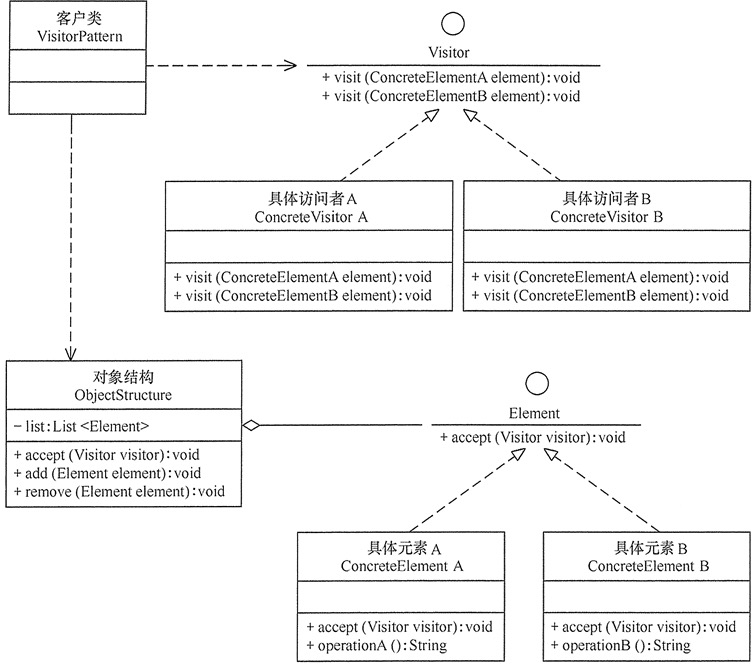

## 访问者模式

#### 定义

将用于某种数据结构中的各元素的操作分离出来封装成独立的类，使其不改变数据结构的前提下可添加作用于这些元素的新的操作，为数据结构中的每个元素提供多种访问方式。

#### 结构

访问者模式包含以下主要角色：

1、抽象访问者（Visitor)：定义一个访问具体元素的接口，为每个具体元素类对应一个访问操作 visit(), 该操作中的参数类型标识了被访问的具体元素。

2、具体访问者（ConcreteVisitor）： 实现抽象访问者中声明的各个访问操作，确定访问者访问一个元素做什么。

3、抽象元素（Element）：声明一个包含接受操作的accept()的接口，被接受的访问者对象作为accept()方法的参数。

4、具体元素(ConcreteElement)：实现抽象元素提供的accept角色，其方法体通常都是visitor.visit(this),另外具体元素中可能还包含本身业务逻辑的相关操作。

5、对象结构（Object Structure）角色：是一个包含元素角色的容器，提供让访问者对象遍历容器中的所有元素的方法，通常由 List、Set、Map 等聚合类实现。



#### 实现

```java

/**
 * @author xueshanshan
 * @date 2019-10-15
 */
//抽象访问者类
public interface Visitor {
    void visit(Element.ConcreteElementA concreteElementA);

    void visit(Element.ConcreteElementB concreteElementB);

    /**
     * 具体访问者A
     */
    public class ConcreteVisitorA implements Visitor {

        @Override
        public void visit(Element.ConcreteElementA concreteElementA) {
            System.out.print("具体访问者A访问->");
            concreteElementA.operationA();
        }

        @Override
        public void visit(Element.ConcreteElementB concreteElementB) {
            System.out.print("具体访问者A访问->");
            concreteElementB.operationB();
        }
    }

    /**
     * 具体访问者B
     */
    public class ConcreteVisitorB implements Visitor {

        @Override
        public void visit(Element.ConcreteElementA concreteElementA) {
            System.out.print("具体访问者B访问->");
            concreteElementA.operationA();
        }

        @Override
        public void visit(Element.ConcreteElementB concreteElementB) {
            System.out.print("具体访问者B访问->");
            concreteElementB.operationB();
        }
    }
}

```

```java
/**
 * @author xueshanshan
 * @date 2019-10-15
 */
//抽象元素类
public interface Element {
    void accept(Visitor visitor);


    /**
     * 具体元素A
     */
    public class ConcreteElementA implements Element {

        @Override
        public void accept(Visitor visitor) {
            visitor.visit(this);
        }

        public void operationA() {
            System.out.println("具体元素A的操作");
        }
    }

    /**
     * 具体元素B
     */
    public class ConcreteElementB implements Element {

        @Override
        public void accept(Visitor visitor) {
            visitor.visit(this);
        }

        public void operationB() {
            System.out.println("具体元素B的操作");
        }
    }

}

```

```java
import java.util.ArrayList;
import java.util.Iterator;
import java.util.List;

/**
 * @author xueshanshan
 * @date 2019-10-15
 */
//对象结构角色
public class ObjectStructure {
    private List<Element> elements = new ArrayList<>();

    public void add(Element element) {
        elements.add(element);
    }

    public void remote(Element element) {
        elements.remove(element);
    }

    public void accept(Visitor visitor) {
        Iterator<Element> iterator = elements.iterator();
        while (iterator.hasNext()) {
            Element element = iterator.next();
            element.accept(visitor);
        }
    }
}

```

```java
/**
 * @author xueshanshan
 * @date 2019-10-15
 */
public class Test {

    public static void main(String[] args) {
        ObjectStructure objectStructure = new ObjectStructure();
        objectStructure.add(new Element.ConcreteElementA());
        objectStructure.add(new Element.ConcreteElementB());
        objectStructure.accept(new Visitor.ConcreteVisitorA());
        objectStructure.accept(new Visitor.ConcreteVisitorB());
    }
}

```

#### 应用实例

利用访问者模式模拟艺术公司与造币公司的功能

分析：艺术公司利用铜可以设计出铜像，利用纸可以画出图画；造币公司利用铜可以引出铜币，利用纸可以引出纸币

具体代码类似上面实现代码，略。

